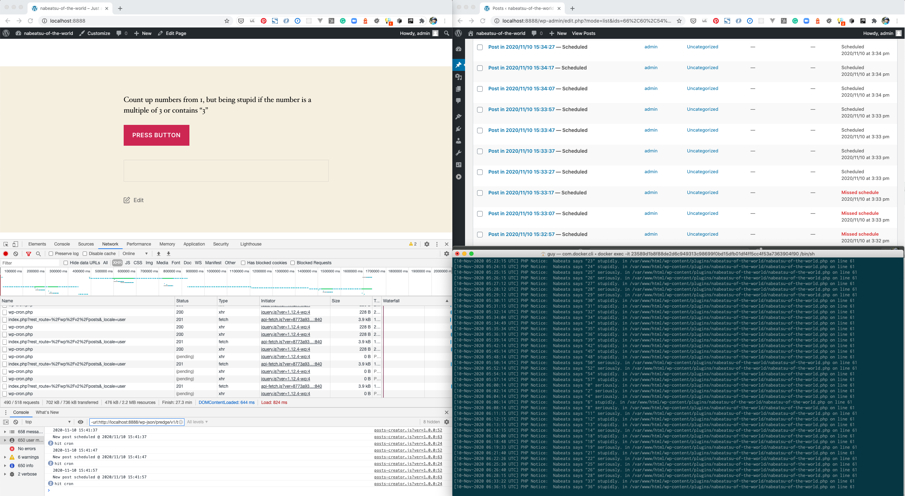

# Nabeats of the World

A WordPress plugin to reproduce [missed schedules](https://wordpress.org/support/topic/why-does-missed-schedule-even-exist/) occured by WP-Cron's fundamental architecture.

## Summary

WordPress has schedule feature, but it sometimes fails and failed posts are marked as "Missed schedule".

This happens eventually and hard to reproduce. This plugin reproduce it exactly even on local site.

### Related Information

- [Why does missed schedule even exist?](https://wordpress.org/support/topic/why-does-missed-schedule-even-exist/)
- [The design of update_option etc makes race conditions likely to happen](https://core.trac.wordpress.org/ticket/25623)
- [Replace alloptions with a key cache](https://core.trac.wordpress.org/ticket/31245)

## How It Works

This plugin will:

1. Create a page and assign it as front page.
2. Regsiter minutely cron job which simply write log the digit of minutes.
3. Only if the digit of minutes is a multiple of 3 or including "3", cron job takes 40 seconds. This reproduce eventually slow cron task.
4. On front page, click "Press Button" to start bulk post. JavaScript's posts a new post every 10 seconds and schedule it for next 5 miutes. You will get 6 new scheduled posts per minutes.

## Exepected Result

- After clicking button and waiting for 1 hour.
- You will get 360 posts.
- Some posts will stay "scheduled" and will be marked as **Missed schedule**



## Why This Happens

Cron process is like below:

https://github.com/WordPress/WordPress/blob/master/wp-cron.php#L79-L146

1. Get cron jobs with `wp_get_ready_cron_jobs()` this will get cron task array from `wp_options` table with `get_option()`
2. In foreach loop in [wp-cron.php](https://github.com/WordPress/WordPress/blob/master/wp-cron.php#L112-L146), scheduling/unscheduling and execution run simultaneously.
3. Scheduling post is also a cron task `wp_schedule_single_event()`. If a super long cron task runs at the time when new post is scheduled, this schedule never registered.
4. As a result, some of scheduled posts will never be published.

## How to Try

You need docker and npm because of dependency to [@wordpress/env](https://github.com/WordPress/gutenberg/tree/master/packages/env).

```
# Clone this repo.
git clone https://github.com/kuno1/nabeatsu-of-the-world.git
# Enter repo.
cd nabeatsu-of-the-world
# Run npm install.
npm install
# Start docker.
npm start
```

Go to `https://localhost:8888` and enter WordPress admin with credentials. These are wp-env's default.

- User login: `admin`
- Password: `password`

Go to general setting, `Setting > General` and change timezone to yours.

Then, go to front page and you will find a single button and click it. WordPress starts posting.

Wating 10 minutes or mote, you can find many posts on your posts list. Some of are "Missed schedule".

## How to Customize

To make a new patch, you can replace customized `wp-cron.php` via WP-CLI command.

```
# Use wp-cron.php in your repo.
# npm run cli is equivalent of wp defined in package.json
npm run cli nabeatsu replace
# Restore original wp-cron.php
npm run cli nabeatsu restore
# Check which version is loaded as wp-cron.php
npm run cli nabeatsu current
```

After `wp nabeatsu replace`, you can edit `wp-cron.php` in this repo. Every change will be applied to your WordPress instance in docekr.

There're 2 utility command for development.

```
# Erase all post data.
npm run cli nabeatsu clean
# Display stats of miss scheduled.
npm run cli nabeatus stats
```

## How to contribute

Please feel free to send [Pull Requests](https://github.com/kuno1/nabeatsu-of-the-world/pulls) or make an [issue](https://github.com/kuno1/nabeatsu-of-the-world/issues).

## Acknowledgment

This plugin is inspired by a Japanese commedian a.k.a "[世界のナベアツ](https://ja.wikipedia.org/wiki/%E6%A1%82%E4%B8%89%E5%BA%A6)"(Sekai no Nabe Atsu). His joke "Being stupid while counting number only if the number is a multiple of 3 or including 3" is a fundamental of this plugin's cron task.